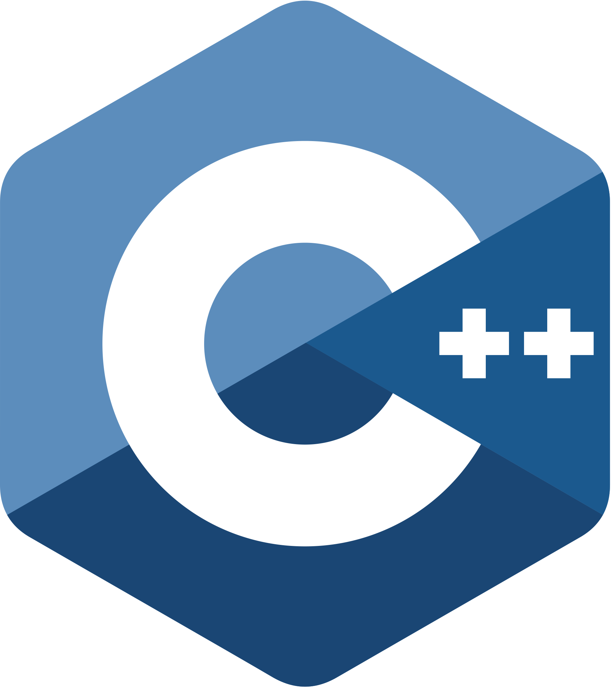

# Hey There👋,  I'm Divyam Agarwal

I am a versatilist and a fast learner. Currently, I am into Web Development, building clones. I love exploring new Tech stack 💻 and leveraging them to build cool projects.
 

## 🧐 <u>More About Me:</u>

- &nbsp; I&#39;m currently working on **netflix-clone**.
- &nbsp; I&#39;m also currently learning Data Structures and Algorithms.
- &nbsp; Most of my projects are available on [Github](https://github.com/Divyam2600?tab=repositories).
- &nbsp; My over-powered build is the [insta-clone](https://github.com/Divyam2600/Instagram-2.0). Do check it out ✨!
- &nbsp; I&#39;m happy to help you out so don't hesitate to approach me.
- &nbsp; Feel free to connect with me on [LinkedIn](https://linkedin.com/in/divyam-agarwal-2600).
- &nbsp; During my leisure, I like to read novels.

 

## 🔨 <u>Languages and Tools:</u>

<table>
   <tr>
      <td align="center" width="96">
           JAVA
      </td>
      <td align="center" width="96">
           C++
      </td>
      <td align="center" width="96">
           HTML
      </td>
      <td align="center" width="96">
           CSS
      </td>
      <td align="center" width="96">
           JAVASCRIPT
      </td>
      <td align="center" width="96">
           REACT
      </td>
      <td align="center" width="96">
           NEXTJS
      </td>
   </tr>
   <tr>
      <td align="center" width="96">
           PYTHON
      </td>
      <td align="center" width="96">
           BOOTSTRAP
      </td>
      <td align="center" width="96">
           TAILWIND
      </td>
      <td align="center" width="96">
           FIREBASE
      </td>
      <td align="center" width="96">
           REDUX
      </td>
      <td align="center" width="96">
           STRIPE
      </td>
      <td align="center" width="96">
           POWERSHELL
      </td>
   </tr>
</table>

 

## 📊 <u>My Stats:</u>

 

## <u>❤️Show Your Support</u>

### Do Star My Repositories if you like them🌟
